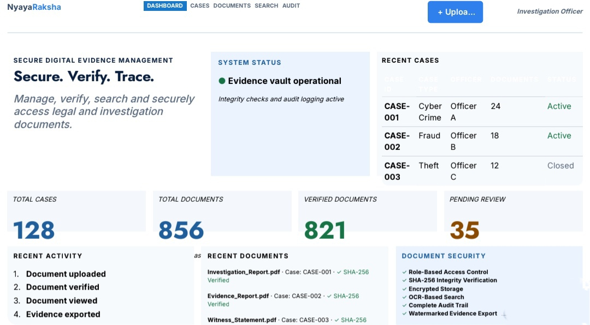

# NyayaRaksha

## Secure Digital Document Management System

### Smart India Hackathon 2026

NyayaRaksha is a proposed secure digital platform for managing
legal and investigation documents in a centralized and traceable way.

## Prototype

This prototype demonstrates the dashboard interface designed
for an Investigation Officer.

### Key Features

- Case Management
- Document Management
- Secure Document Upload
- Role-Based Access Control
- SHA-256 Integrity Verification
- OCR-Based Search
- Audit Trail
- Watermarked Evidence Export
- Encrypted Storage

## Prototype Screenshot

## 📊 Demo Data Disclaimer

The values shown in the dashboard, such as 128 cases,
856 documents, 821 verified documents and 35 pending reviews,
are sample/demo data used only for demonstrating the prototype.

The displayed case IDs, officers and document names are also
fictional/sample data and do not represent real investigation data.

## Future Scope

The UI prototype will be extended into a fully functional system
with authentication, database integration, secure storage,
document integrity verification and audit logging.

## Objective

To provide a secure, efficient and traceable platform for
managing sensitive legal and investigation documents.
